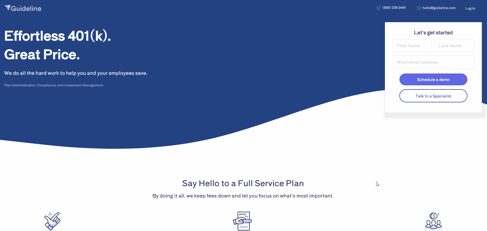
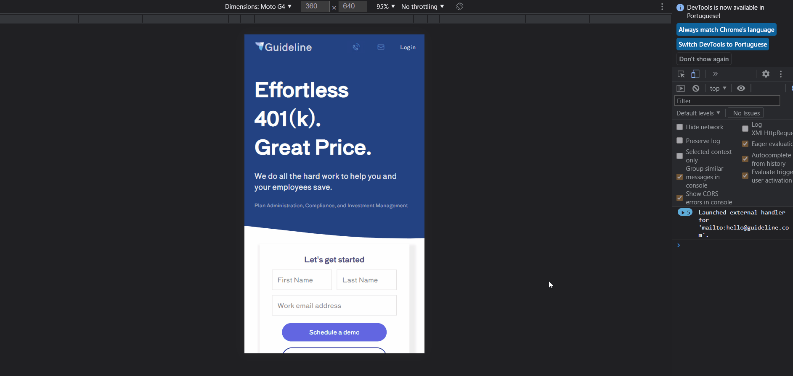
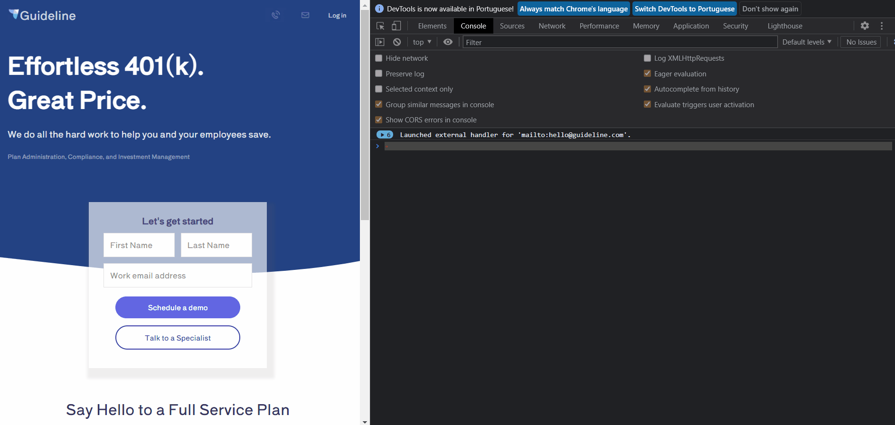

# **Página Responsiva.**
### Este projeto se trata de uma página clone responsiva construída usando as convenções BEM(Blocks, Elements and Modifiers).
 
## :hammer: Techs:
  * HTML
  * CSS

## :rocket: Conhecimentos adquiridos:
* Utilizar as Covenções BEM (Blocks, Elements and Modifiers)
* Elaborar uma página clone responsiva usado @media

## :art: Projeto / Desafio:
 

  

  

 

Feito de ♥ por Igor Irineu

